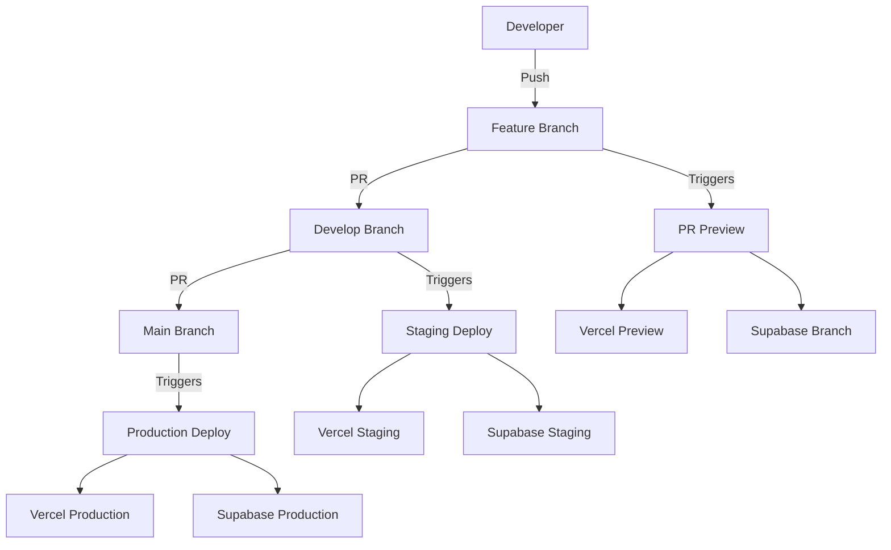

# AptlySaid GitOps Workflow Guide

## Overview

This repository implements a complete GitOps workflow for both frontend (Vercel) and backend (Supabase) deployments. All changes must go through Git, with automatic deployments triggered by push events.

## Architecture



## Environments

### 1. Development (Local)

- **Purpose**: Local development and testing
- **Branch**: Feature branches
- **Vercel**: Local dev server (`npm run dev`)
- **Supabase**: Local Docker instance (`supabase start`)

### 2. Preview (Pull Requests)

- **Purpose**: Review changes before merging
- **Branch**: Any PR against `develop` or `main`
- **Vercel**: Automatic preview deployments
- **Supabase**: Isolated preview branches
- **URL Pattern**: `https://aptlysaid-pr-{number}.vercel.app`

### 3. Staging

- **Purpose**: Pre-production testing
- **Branch**: `develop`
- **Vercel**: Staging deployment
- **Supabase**: Staging branch
- **URL**: `https://staging-aptlysaid.vercel.app`

### 4. Production

- **Purpose**: Live application
- **Branch**: `main`
- **Vercel**: Production deployment
- **Supabase**: Production database
- **URL**: `https://aptlysaid.com`

## Workflow

### Standard Development Flow

1. **Create Feature Branch**

   ```bash
   git checkout -b feature/your-feature-name
   ```

2. **Develop Locally**

   ```bash
   npm run dev
   supabase start
   ```

3. **Create Pull Request**
   - Target: `develop` branch
   - Automatic triggers:
     - CI/CD checks (lint, test, build)
     - Vercel preview deployment
     - Supabase preview branch creation

4. **Review & Merge to Develop**
   - Requires 1 approval
   - All CI checks must pass
   - Automatic staging deployment

5. **Release to Production**
   - Create PR from `develop` to `main`
   - Requires approval
   - Automatic production deployment on merge

### Branch Protection Rules

#### Main Branch

- ✅ Require pull request reviews (1 approval)
- ✅ Dismiss stale reviews
- ✅ Require approval from last pusher
- ✅ Require status checks:
  - `continuous-integration`
  - `lint`
  - `typecheck`
  - `test`
- ✅ Require branches to be up to date
- ✅ Require conversation resolution
- ❌ Allow force pushes
- ❌ Allow deletions

#### Develop Branch

- Same as main branch (configured separately if needed)

## CI/CD Pipeline

### GitHub Actions Workflows

#### 1. GitOps CI/CD Pipeline (`gitops-ci-cd.yml`)

**Triggers**: Push to `develop`/`main`, Pull Requests

**Jobs**:

- `lint`: Code formatting and linting
- `typecheck`: TypeScript type checking
- `test`: Unit test execution
- `build`: Application build verification
- `supabase-check`: Migration validation
- `security-scan`: Vulnerability scanning
- `deploy-preview`: PR preview deployments
- `deploy-staging`: Staging deployments (develop branch)
- `deploy-production`: Production deployments (main branch)

#### 2. Supabase Branching (`supabase-branching.yml`)

**Triggers**: Pull Request events, Manual dispatch

**Features**:

- Automatic preview branch creation for PRs
- Branch cleanup on PR close
- Staging branch synchronization
- Manual branch management options

#### 3. Environment Management (`environments.yml`)

**Triggers**: Manual dispatch only

**Actions**:

- Deploy to specific environment
- Rollback deployments
- Sync secrets between GitHub and Vercel
- Health checks for all environments

## Configuration Files

### `vercel.json`

- Framework: SvelteKit
- Build settings
- Environment-specific deployments
- Branch deployment rules

### `supabase/config.toml`

- Local development settings
- Database configuration
- Edge function settings

## Required Secrets

### GitHub Secrets

```yaml
# Vercel
VERCEL_ORG_ID: Your Vercel organization ID
VERCEL_PROJECT_ID: Your Vercel project ID
VERCEL_TOKEN: Vercel API token

# Supabase
SUPABASE_ACCESS_TOKEN: Supabase CLI access token
SUPABASE_PROJECT_ID: Supabase project reference
SUPABASE_DB_PASSWORD: Database password
SUPABASE_URL: Supabase project URL
SUPABASE_ANON_KEY: Supabase anonymous key
SUPABASE_SERVICE_ROLE_KEY: Supabase service role key

# Environment-specific
STRIPE_SECRET_KEY_PROD: Production Stripe key
STRIPE_SECRET_KEY_TEST: Test Stripe key
RESEND_API_KEY_PROD: Production Resend key
RESEND_API_KEY_TEST: Test Resend key

# Optional
SNYK_TOKEN: Snyk security scanning token
```

## Database Migrations

### Creating Migrations

```bash
# Generate migration from local changes
supabase db diff -f your_migration_name

# Create manual migration
supabase migration new your_migration_name
```

### Migration Flow

1. Develop and test locally
2. Commit migration files to Git
3. PR creates preview branch with migrations
4. Merge to develop applies to staging
5. Merge to main applies to production

### Rollback Procedure

```bash
# Manual rollback required for Supabase
# Connect to the target database
supabase db remote commit --revert

# Or use SQL to manually revert changes
```

## Commands Reference

### Local Development

```bash
# Start local environment
npm run dev
supabase start

# Run tests and checks
npm run validate  # Runs format, lint, typecheck, and tests
npm run test
npm run lint
npm run typecheck

# Database operations
supabase db reset     # Reset local database
supabase db push      # Apply migrations locally
supabase gen types    # Generate TypeScript types
```

### Deployment Management

```bash
# Manual deployment (via GitHub Actions)
# Use the Environment Management workflow

# Check deployment status
vercel list

# View logs
vercel logs [deployment-url]
```

### Branch Management

```bash
# Create feature branch
git checkout -b feature/your-feature

# Update from develop
git checkout develop
git pull origin develop
git checkout feature/your-feature
git merge develop

# Clean up old branches
git branch -d feature/old-feature
git push origin --delete feature/old-feature
```

## Monitoring & Debugging

### Health Checks

- API endpoint: `/api/health`
- Automated health checks in CI/CD
- Manual checks via Environment Management workflow

### Logs

- **Vercel**: Dashboard → Functions → Logs
- **Supabase**: Dashboard → Logs → Edge Functions
- **GitHub Actions**: Actions tab → Workflow runs

### Common Issues

#### 1. Migration Conflicts

**Solution**: Reset preview branch

```bash
supabase branches delete preview-pr-XXX
# Recreate via new push to PR
```

#### 2. Failed Deployments

**Check**:

- GitHub Actions logs
- Required secrets are set
- Branch protection rules
- CI/CD status checks

#### 3. Environment Variables Mismatch

**Solution**: Use Environment Management workflow to sync secrets

## Best Practices

### Code Quality

1. Always run `npm run validate` before committing
2. Write tests for new features
3. Keep PRs focused and small
4. Update documentation with code changes

### Database Changes

1. Test migrations locally first
2. Include rollback scripts for complex changes
3. Never modify production data directly
4. Use seed data for preview branches

### Security

1. Never commit secrets to Git
2. Use environment variables for sensitive data
3. Rotate keys regularly
4. Enable 2FA on all accounts

### Deployment Safety

1. Always deploy to staging first
2. Run health checks after deployment
3. Monitor error rates post-deployment
4. Have rollback plan ready

## Emergency Procedures

### Production Rollback

1. Use Environment Management workflow → Rollback
2. Or manually via Vercel dashboard
3. For database: Restore from backup if needed

### Incident Response

1. Check health endpoints
2. Review recent deployments
3. Check error logs
4. Rollback if necessary
5. Post-mortem after resolution

## Support

For issues or questions:

1. Check GitHub Actions logs
2. Review this documentation
3. Check Vercel and Supabase dashboards
4. Create an issue in the repository

## Appendix

### Useful Links

- [Vercel Documentation](https://vercel.com/docs)
- [Supabase Documentation](https://supabase.com/docs)
- [GitHub Actions Documentation](https://docs.github.com/en/actions)
- [SvelteKit Documentation](https://kit.svelte.dev/docs)
