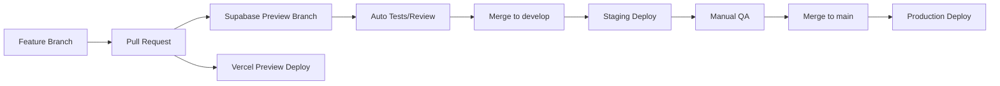

# GitOps Strategy Guide for Multi-Tenant SvelteKit + Supabase + Vercel

## Overview

This guide provides a simple and elegant GitOps strategy designed for small teams (1 lead + 2-3 junior developers) managing a multi-tenant SvelteKit application with Supabase backend and Vercel hosting.

## 🏗️ Repository Structure

Use a **single-repo approach** with environment-based branching for simplicity:

```
your-app/
├── .github/
│   └── workflows/
│       ├── ci.yml
│       ├── preview.yml
│       └── production.yml
├── src/                    # SvelteKit app code
├── supabase/
│   ├── migrations/
│   ├── functions/          # Edge functions
│   ├── seed.sql
│   └── config.toml
├── environments/
│   ├── preview.env
│   └── production.env
└── docs/
    └── deployment.md
```

## 🔄 Branch Strategy (Trunk-Based Development)

Keep it simple with three main branches:

- **`main`** → Production environment
- **`develop`** → Staging/preview environment
- **`feature/*`** → Feature branches (short-lived)

## 🚀 GitOps Workflow

### Development Workflow



### Automated Pipeline Setup

#### `.github/workflows/ci.yml` (Runs on all PRs)

```yaml
name: CI
on:
  pull_request:
    branches: [develop, main]

jobs:
  test:
    runs-on: ubuntu-latest
    steps:
      - uses: actions/checkout@v4
      - uses: actions/setup-node@v4
        with:
          node-version: 18
          cache: "npm"
      - run: npm ci
      - run: npm run build
      - run: npm run test
      - run: npm run lint

  supabase-check:
    runs-on: ubuntu-latest
    steps:
      - uses: actions/checkout@v4
      - uses: supabase/setup-cli@v1
      - run: supabase db start
      - run: supabase db lint
```

#### `.github/workflows/preview.yml` (Staging deployments)

```yaml
name: Preview Deploy
on:
  push:
    branches: [develop]
  pull_request:
    branches: [develop]

jobs:
  deploy:
    runs-on: ubuntu-latest
    environment: preview
    steps:
      - uses: actions/checkout@v4
      - uses: supabase/setup-cli@v1
      - name: Deploy Supabase Functions
        run: |
          supabase functions deploy --project-ref ${{ secrets.SUPABASE_PREVIEW_PROJECT_ID }}
        env:
          SUPABASE_ACCESS_TOKEN: ${{ secrets.SUPABASE_ACCESS_TOKEN }}
      # Vercel handles the frontend automatically via GitHub integration
```

#### `.github/workflows/production.yml` (Production deployments)

```yaml
name: Production Deploy
on:
  push:
    branches: [main]

jobs:
  deploy:
    runs-on: ubuntu-latest
    environment: production
    steps:
      - uses: actions/checkout@v4
      - uses: supabase/setup-cli@v1
      - name: Deploy Supabase Functions
        run: |
          supabase functions deploy --project-ref ${{ secrets.SUPABASE_PROD_PROJECT_ID }}
        env:
          SUPABASE_ACCESS_TOKEN: ${{ secrets.SUPABASE_ACCESS_TOKEN }}
```

## 🗄️ Database Migration Strategy

Leverage **Supabase Branching 2.0** for elegant database management.

### Setup Instructions

1. Enable GitHub Integration in your Supabase project
2. Configure automatic branching for preview environments
3. Set up required environment variables in GitHub secrets

### Migration Workflow

```bash
# 1. Create feature branch
git checkout -b feature/user-profiles

# 2. Create migration locally
supabase migration new add_user_profiles_table

# 3. Write your SQL migration
# supabase/migrations/20240824120000_add_user_profiles_table.sql

# 4. Test locally
supabase db reset
supabase db start

# 5. Push to GitHub - Supabase automatically creates preview branch
git add . && git commit -m "Add user profiles table"
git push origin feature/user-profiles

# 6. Create PR - preview environment is ready with migration applied
# 7. After review, merge to develop for staging
# 8. Finally merge to main for production
```

## 🏢 Multi-Tenant Environment Variables

For your multi-tenant architecture, implement tenant isolation at the application level:

### Preview/Staging Environment

```bash
NEXT_PUBLIC_SUPABASE_URL=your-preview-project.supabase.co
NEXT_PUBLIC_SUPABASE_ANON_KEY=preview_anon_key
SUPABASE_SERVICE_ROLE_KEY=preview_service_role
```

### Production Environment

```bash
NEXT_PUBLIC_SUPABASE_URL=your-prod-project.supabase.co
NEXT_PUBLIC_SUPABASE_ANON_KEY=prod_anon_key
SUPABASE_SERVICE_ROLE_KEY=prod_service_role
```

## 👨‍💻 Junior Developer Onboarding

### Developer Workflow

1. **Always start from `develop`**: `git checkout develop && git pull`
2. **Create feature branch**: `git checkout -b feature/my-feature`
3. **Make changes and test locally**: `npm run dev`
4. **Create PR to `develop`** (never directly to `main`)
5. **Wait for CI checks** and preview deployment
6. **Request review** from senior team member
7. **Merge after approval**

### Safety Guards (Branch Protection Rules)

Configure in GitHub UI for each branch:

#### For `main` branch:

- Require pull request reviews (1 reviewer)
- Require status checks (CI must pass)
- Require branches to be up to date
- Restrict pushes to this branch

#### For `develop` branch:

- Require status checks (CI must pass)
- Allow auto-merge after checks

## 📊 Monitoring & Observability

### Health Check Workflow

Create `.github/workflows/health-check.yml`:

```yaml
name: Health Check
on:
  schedule:
    - cron: "*/15 * * * *" # Every 15 minutes

jobs:
  health:
    runs-on: ubuntu-latest
    steps:
      - name: Check Production Health
        run: |
          curl -f https://your-app.vercel.app/api/health || exit 1
      - name: Check Database Health
        run: |
          # Add your DB health check here
```

## 🔧 Team Workflow Guidelines

### For Lead Developer (You)

- Review all PRs to `main`
- Manage production deployments
- Handle database schema changes
- Set up branch protection rules

### For Junior Developers

- Work only in feature branches
- Always create PRs to `develop` first
- Never bypass CI checks
- Document changes in PR descriptions

## 🚀 Implementation Checklist

### 1. GitHub Setup

- [ ] Set up GitHub secrets:
  - `SUPABASE_ACCESS_TOKEN`
  - `SUPABASE_PROD_PROJECT_ID`
  - `SUPABASE_PREVIEW_PROJECT_ID`

### 2. Supabase Configuration

- [ ] Enable GitHub integration
- [ ] Set up automatic branching
- [ ] Configure preview branch settings

### 3. Vercel Configuration

- [ ] Install Supabase integration
- [ ] Set up preview deployments
- [ ] Configure environment variables

### 4. Repository Protection

- [ ] Set up branch protection for `main`
- [ ] Require PR reviews
- [ ] Require CI checks
- [ ] Configure environments in GitHub

### 5. Team Onboarding

- [ ] Create developer documentation
- [ ] Set up local development environment
- [ ] Train junior developers on workflow

## 📝 Additional Files to Create

### `environments/preview.env`

```env
# Preview Environment Variables
NEXT_PUBLIC_SUPABASE_URL=
NEXT_PUBLIC_SUPABASE_ANON_KEY=
SUPABASE_SERVICE_ROLE_KEY=
```

### `environments/production.env`

```env
# Production Environment Variables
NEXT_PUBLIC_SUPABASE_URL=
NEXT_PUBLIC_SUPABASE_ANON_KEY=
SUPABASE_SERVICE_ROLE_KEY=
```

### `docs/deployment.md`

```markdown
# Deployment Process

## Quick Reference

- Feature development: Always branch from `develop`
- Staging deployment: Merge PR to `develop`
- Production deployment: Merge PR to `main`

## Emergency Procedures

- Rollback: Revert commit on `main` branch
- Hotfix: Create hotfix branch from `main`, merge back to both `main` and `develop`

## Database Migrations

- Always test locally first
- Preview branches automatically created
- Never edit migrations after they've been applied to production
```

## 🎯 Key Benefits of This Strategy

1. **Simple for Small Teams**: Minimal complexity, easy to understand
2. **Safe Deployments**: Multiple environments with automatic testing
3. **Developer Friendly**: Familiar Git workflows
4. **Scalable**: Can grow with your team and application
5. **Automated**: Leverages native integrations between tools
6. **Traceable**: Full audit trail of all changes

## 🔗 Useful Resources

- [Supabase Branching Documentation](https://supabase.com/docs/guides/deployment/branching)
- [Vercel GitHub Integration](https://vercel.com/docs/deployments/git)
- [GitHub Actions Documentation](https://docs.github.com/en/actions)
- [GitOps Best Practices](https://www.gitops.tech/)

---

This GitOps strategy is designed to be **simple, safe, and scalable** for your small team while providing room to grow. It leverages native integrations between GitHub, Vercel, and Supabase to minimize complexity while maximizing automation and safety.
