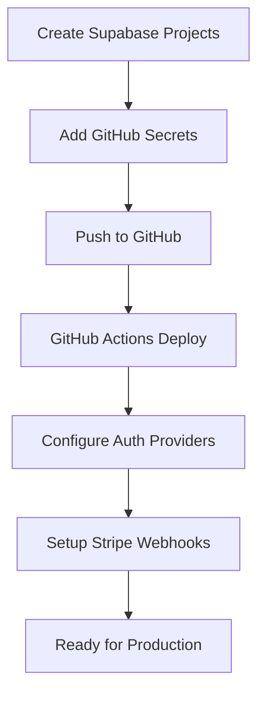

# Automated vs Manual Setup Guide

## ✅ Fully Automated via GitHub Actions

These are deployed automatically on every push to `develop` (preview) or `main` (production):

### Database

- ✅ **All migrations** (schema, tables, functions, RLS policies)
- ✅ **pg_cron jobs** (scheduled tasks)
- ✅ **Vault setup** (encrypted secrets table and functions)
- ✅ **Vault secrets** (populated from GitHub Secrets)
- ✅ **Database configuration** (app.settings for cron jobs)
- ✅ **Storage buckets** (creation and policies)
- ✅ **Seed data** (optional, on manual trigger)

### Edge Functions

- ✅ **Function deployment** (all TypeScript code)
- ✅ **Function secrets** (environment variables)
- ✅ **Function configuration** (URLs, service keys)

### Configuration

- ✅ **All secrets management** (from GitHub Secrets)
- ✅ **Inter-service URLs** (automatically configured)
- ✅ **Database settings** (for cron job execution)

## ⚠️ One-Time Manual Setup Required

These must be configured once in the Supabase Dashboard:

### 1. Auth Providers (Supabase Dashboard)

**Location**: Authentication → Providers

- **Email**:

  - ✅ Already configured via config.toml
  - Verify SMTP settings if using custom email

- **Google OAuth**:
  - Enable provider
  - Add Client ID and Secret (same as GitHub Secrets)
  - Configure redirect URLs:
    ```
    https://YOUR_PROJECT.supabase.co/auth/v1/callback
    https://your-app-domain.com/auth/callback
    ```

### 2. Custom Domain (Optional)

**Location**: Settings → Custom Domains

- Add your domain
- Configure DNS records
- Update redirect URLs

### 3. Network Restrictions (Optional)

**Location**: Settings → Database

- Configure allowed IPs
- Set up connection pooling

### 4. Webhook Endpoints (Stripe)

**Location**: Stripe Dashboard → Webhooks

- Add endpoint: `https://YOUR_PROJECT.supabase.co/functions/v1/v2-api/stripe/webhook`
- Select events to listen for
- Copy webhook secret to GitHub Secrets

## 🚀 Initial Setup Flow



## 📋 Complete Setup Checklist

### Phase 1: Project Creation

- [ ] Create Preview Supabase project
- [ ] Create Production Supabase project
- [ ] Note down all project IDs and keys

### Phase 2: GitHub Configuration

- [ ] Fork/Clone repository
- [ ] Add all ~25 GitHub Secrets
- [ ] Enable GitHub Actions

### Phase 3: First Deployment

- [ ] Push to `develop` branch
- [ ] Watch Preview Full Deploy workflow
- [ ] Verify all green checkmarks

### Phase 4: Manual Configuration

- [ ] Enable Google OAuth in Supabase
- [ ] Configure Stripe webhooks
- [ ] Set custom domain (if needed)
- [ ] Configure SMTP (if custom)

### Phase 5: Production Deployment

- [ ] Merge develop → main
- [ ] Watch Production Full Deploy workflow
- [ ] Repeat Phase 4 for production

## 🔄 Ongoing Deployments

After initial setup, everything is automated:

| Action            | Trigger   | What Happens               |
| ----------------- | --------- | -------------------------- |
| Push to `develop` | Automatic | Full preview deployment    |
| Push to `main`    | Automatic | Full production deployment |
| New migration     | Push      | Automatically applied      |
| New edge function | Push      | Automatically deployed     |
| Secret update     | GitHub UI | Redeploy to apply          |
| Cron job change   | Push      | Automatically updated      |

## 🛠️ Manual Interventions Needed

### When Adding New OAuth Providers

1. Add credentials to GitHub Secrets
2. Update edge function deploy in workflow
3. Enable in Supabase Dashboard

### When Changing Email Provider

1. Update SMTP settings in Supabase
2. Update email templates if needed

### When Adding New Storage Buckets

1. Add to migration file
2. Will auto-deploy on next push

### When Updating Stripe Products

1. Create products in Stripe Dashboard
2. Update Price IDs in GitHub Secrets
3. Redeploy functions

## 📊 Monitoring Post-Deployment

Automated verification happens in GitHub Actions:

- Cron jobs status
- Edge functions list
- Secrets count

Manual verification in Supabase Dashboard:

- Auth provider status
- Database performance
- Edge function logs
- Storage usage

## 🚨 Troubleshooting

### If Deployment Fails

1. **Check GitHub Actions logs**

   - Which step failed?
   - Missing secrets?
   - Database connection issues?

2. **Common Issues**:

   - **Vault not created**: First deployment creates it
   - **Cron jobs not running**: Check database settings
   - **Functions not authenticated**: Verify service role key
   - **Secrets not working**: Check GitHub Secrets spelling

3. **Recovery**:

   ```bash
   # Re-run failed workflow
   GitHub → Actions → Failed workflow → Re-run jobs

   # Or trigger manually
   GitHub → Actions → Workflow → Run workflow
   ```

## 💡 Best Practices

1. **Test in Preview First**

   - All changes go through develop → preview
   - Verify in preview before production

2. **Use GitHub Environments**

   - Add approval requirements for production
   - Separate secrets per environment

3. **Monitor After Deployment**

   - Check Supabase logs
   - Verify cron job execution
   - Test edge function endpoints

4. **Keep Secrets Secure**
   - Rotate regularly
   - Never log or expose
   - Use different values per environment
